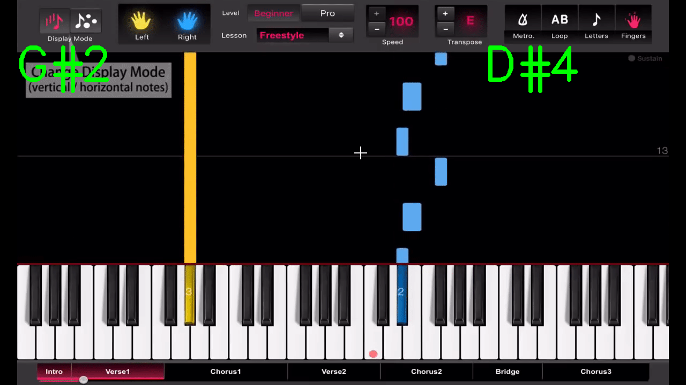

# Polygon
This project was to extract the note from piano tutoral videos for ease of learning, the code was hardcoded for the video in the folder.
So downlaod and run the project in c++. The orignal video plays smoothly but my aim was to add the solfas as the piano were being played.
So i used openCV to extract the postion of the note being played and mapped the position to the appropiate solfa note

You would need these dlls 
opencv_videoio_ffmpeg480_64.dll
opencv_world480.dll
opencv_world480d.lib
